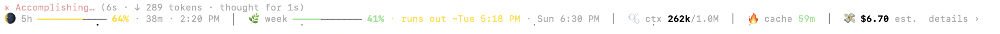
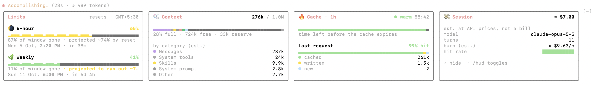

# Usage HUD for Claude Code

A small usage bar that sits above the Claude Code prompt and opens into a row of cards. You can see how much of your plan limits you have used, when they reset in your own time zone, whether you're using them faster than the clock refills them, what is filling your context window, whether the prompt cache is still warm, and roughly what the session would cost at API prices.



Click `details ›` (or type `/hud`) and the bar opens into four cards above the prompt: **Limits**, **Context**, **Cache** and **Session**. They are drawn on your terminal's own background, so they fit light and dark terminals alike.



## Install

You need Claude Code 2.1.289 or later (plugins written as hook modules). In a terminal:

```sh
claude plugin marketplace add rsvishalsingh93/claude-usage-hud
claude plugin install usage-hud@claude-usage-hud
```

Then restart Claude Code, or run `/reload-plugins` in a running session. The bar appears above the prompt once the session has usage to show.

Inside Claude Code you can do the same with `/plugin marketplace add rsvishalsingh93/claude-usage-hud` followed by `/plugin install usage-hud@claude-usage-hud`.

### Update and remove

```sh
claude plugin marketplace update claude-usage-hud
claude plugin update usage-hud@claude-usage-hud

claude plugin uninstall usage-hud@claude-usage-hud
claude plugin marketplace remove claude-usage-hud
```

## Use

| | |
| --- | --- |
| `details ›` or `/hud` | open the cards; `‹ hide` or `/hud` again closes them |
| `/hud calm` | stop the animations (icons and numbers stay); run it again to turn them back on |

## What you are looking at

**The bars.** The fill is how much of a limit is used, green, then amber, then red as it fills. If your current pace would use a limit up before it resets, the bar says when, in amber: `runs out ~Thu 4:10 PM`. When it doesn't, nothing extra is shown. In the cards, the bars ripple while Claude is spending tokens and stand still otherwise.

**The icons** change with the value beside them:

| | |
| --- | --- |
| 🌕 🌖 🌗 🌘 🌑 | 5-hour limit: a moon waning as the limit drains |
| 🌱 🌿 🌳 🍂 🥀 | weekly limit: a plant ageing through the week |
| 🫧 🎈 💥 | context: a bubble filling up; 💥 means automatic compaction is close |
| 🔥 ⏳ 🧊 | prompt cache: warm, last five minutes (the time switches to a mm:ss countdown), cold |
| 🪙 💸 | cost: idle, spending |

**The cards.**

- **Limits**: each limit's bar, how much of its window has gone, where your pace takes you ("~72% by reset", or "runs out ~Tue 5:18 PM"), and the exact reset date and time in your computer's time zone.
- **Context**: tokens in the window, a bar split by category (messages, tools, skills, system prompt, ...) with the autocompact reserve at the right end, and the largest categories listed.
- **Cache**: how long the prompt cache stays warm (1 hour on a subscription, 5 minutes on an API key), the last request split into cached, written and new tokens, and its hit rate.
- **Session**: estimated cost, model, turns, estimated burn per hour and the hit rate of recent turns.

## What is exact and what is estimated

| Shown | Where it comes from |
| --- | --- |
| 5-hour and weekly %, reset times | Anthropic's servers, with each response: exact |
| Context tokens (`193k / 1.0M`) | the last response's usage: exact |
| Cache warm or cold, cached/written/new | the last response's usage and the cache lifetime: exact counts, and the countdown assumes the standard lifetime |
| Context by category | Claude Code's local estimate, the same as `/context`: **estimated** |
| Cost, burn per hour | token counts priced at Claude Code's built-in API rates, the same as `/cost`: **estimated**. On a Pro or Max subscription you are not billed per token, so this is what the session would cost on the API, not a charge |
| Pace and projections | your usage over the last half hour once there is ten minutes of it, the window's average before that: **projection** |

## Tips

- The colors follow your Claude Code theme. If the bars look washed out, set `/theme` to **Auto (match terminal)** so Claude Code matches your terminal's light or dark background.
- The cards need about 12 rows. On a short terminal, the space above the prompt scrolls.
- The bar redraws once a second to keep the countdowns live, and about three times a second while Claude is working. `/hud calm` keeps it to once a second.

## What the plugin hooks, and what it doesn't touch

The plugin only reads. It never blocks, rewrites or answers anything that isn't its own: every hook below passes the event on unchanged with `next(e)`, except `/hud`, which it owns.

| Hook | What it does |
| --- | --- |
| `session.start` | registers the `/hud` command, reads the session's usage once and starts the clock that keeps the countdowns live |
| `command.run` (only `/hud`) | opens or closes the cards; `/hud calm` turns the animations off and on. Other commands are not seen |
| `session.measure` | re-reads usage when Claude Code measures the session |
| `turn.start`, `turn.complete` | notes when Claude is working (for the animation), and after each turn records the last request's token counts (cached, written, new) for the Cache card |
| `ui.render` (the band above the prompt) | draws the bar and the cards; it steps aside for Claude Code's own surveys there |

It calls `$.session.usage` (the figures `/cost`, `/context` and the rate-limit headers already give Claude Code), `$.clock`, `$.ui` and `$.state` (its own snapshot, kept for the session). No network calls, no files, no processes, and nothing leaves your computer.

## Develop

The plugin is one hooks module, `plugins/usage-hud/hooks/register.tsx`. To try a change without installing:

```sh
claude --plugin-dir ./plugins/usage-hud
```

Checks:

```sh
claude plugin validate ./plugins/usage-hud
claude plugin test ./plugins/usage-hud
```

## License

MIT
